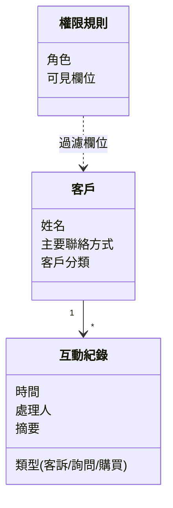
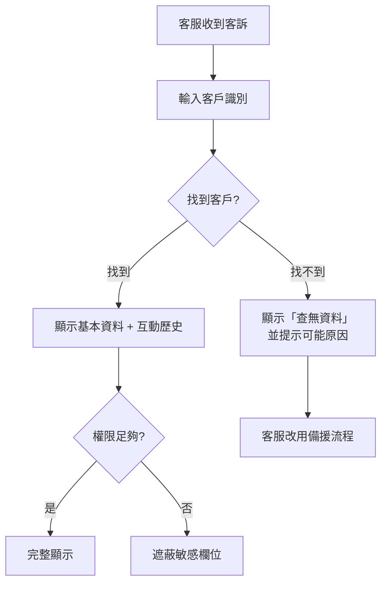
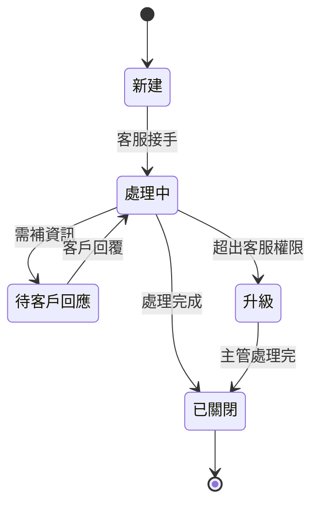

# M4:系統設計思維 Design(課前自學)

> 課程:**Spec-Driven 工程師 — AI Agent 時代的需求釐清訓練**
> 預計閱讀:35–45 分鐘
> 對應課堂場次:S4(W3:Spec 定稿前的設計粒度)
> 重點:**重思維,不重畫圖規範**。圖用 Mermaid 內嵌,夠用就好。

---

## 學習目標

讀完這份你應該能:

1. 區分**邏輯設計**(做什麼)與**實體設計**(用什麼技術做)
2. 用**資料 / 流程 / 狀態**三種視角拆解一個系統
3. 判斷設計「夠不夠細」——細到 AI 做得對的粒度就停

---

## 為什麼這個模組

M3 給你的是清單——一條條的需求、優先序、stakeholder。但清單不是設計:「我要查客戶」跟「客戶資料怎麼組織、查詢怎麼走、客訴案件怎麼變」是兩回事。

```
M3 結構化清單 → M4 三視角組織 → M5 寫成 spec → AI 實作
```

**為什麼 AI 時代邏輯設計反而更重要?**——因為 AI 可以幫你快速試實體實作(換語言、換框架、換 DB),但**邏輯錯了,所有實體實作都是錯的**。AI 不會幫你補你沒想到的概念。

兩大心法回顧:

- **探索**:三視角是探索設計空間的框架——畫到一半畫不下去,通常是 M2/M3 還沒問夠
- **利益關係人**:不同 stakeholder 對「資料怎麼組」「流程怎麼走」「狀態怎麼算結束」會有完全不同的看法——三視角就是讓這些差異顯形的工具

---

## 核心(人人必修)

### 1. M4 的位置:把清單組織成模型

| 上一站(M3)交給你 | M4 你要做的事 | 交給下一站(M5) |
|---|---|---|
| 結構化的需求清單 + 優先序 | 用三視角組織 + 拆到可驗證粒度 | 設計模型(圖 + 文字)足以寫 spec |

### 2. 邏輯設計 vs 實體設計

| 層次 | 在問什麼 | 例子 |
|---|---|---|
| 邏輯設計 | 「做什麼」「概念上有哪些東西、彼此什麼關係」 | 客戶有姓名、聯絡方式、互動歷史;互動歷史每筆有時間、類型、處理人 |
| 實體設計 | 「用什麼技術做、怎麼存、怎麼快」 | PostgreSQL + customer_id 索引、Redis 快取互動歷史前 100 筆 |

M4 主要訓練**邏輯設計**。實體設計留給 AI agent 跟工程師的迭代——但邏輯不對,實體再快都白搭。

### 3. 資料視角:概念上有什麼、彼此怎麼相關

不畫 ER 規範、不寫 schema——畫**概念之間的關係**。客戶資訊工具的資料視角可能長這樣:



注意三件事:

- **沒有資料型別**(那是實體設計)
- **沒有 PK / FK**(那是 schema 細節)
- **有概念跟關係**(這才是邏輯)

### 4. 流程視角:事情怎麼走

對主要使用情境畫一張流程圖,**含分支與例外**:



只畫 happy path 沒用——**分支跟例外才是設計**。M2 的「隱性需求三條挖掘線」(例外情境、邊界、預設)在這裡會回來:你在 M2 挖到的例外情境,M4 要在流程上有對應的分支。

### 5. 狀態視角:某個東西的生命週期

不是所有需求都有狀態,但只要對方講「處理中 / 待 / 已完成 / 結案 / 退回」這類詞,**就有狀態視角**。簡單畫一張:



狀態圖最容易暴露**未定義的轉移**:「處理中」可不可以直接跳「升級」?「待客戶回應」可不可以無限等下去?——畫出來才會問到這些。

### 6. 可驗證粒度:細到哪、停在哪

設計太粗 → AI 補錯;太細 → 你在當 AI(浪費時間,而且 AI 寫得比你快)。

**判準三問句**:

1. 這塊**能不能各自寫驗收條件**?(不能 → 還太粗)
2. 這塊的**例外情境我能不能列出 1–2 個**?(不能 → 你沒想夠)
3. 這塊**我有沒有在寫實作細節**?(有 → 太細,停下來)

三個都 yes(1 跟 2)且第三個 no = 剛好。

---

## 進階延伸(有經驗者深化)

### 設計取捨:你不是在選對錯,是在選代價

| 取捨軸 | 選 A 的代價 | 選 B 的代價 |
|---|---|---|
| 抽象 vs 具體 | 抽象:擴充快,但每加一個 case 都要想 | 具體:寫得快,但加新 case 要改舊的 |
| 彈性 vs 簡單 | 彈性:支援未來,但現在多寫 30% 程式 | 簡單:做得快,未來要改可能要重寫 |
| 一致 vs 在地 | 一致:全系統好維護,但某幾個 case 用起來怪 | 在地:每個 case 都對,但全局看亂 |

**沒有正確答案,有「現在情境下哪個代價我承擔得起」的答案**。把代價講清楚,讓 stakeholder 一起決定。

### 松竹梅:給 stakeholder 三個版本選,不要只給一個

工程師預設給「最佳解」一個答案——但 stakeholder 沒有對照組,他不知道你犧牲了什麼,只能點頭或皺眉。給三層方案,他才知道在選什麼:

| 層級 | 涵蓋 | 代價 | 適用情境 |
|---|---|---|---|
| 松(最完整) | 全功能 + 彈性 | 工期長 / 維護成本高 | 確定要長期演進、stakeholder 願意等 |
| 竹(平衡) | 核心 + 1–2 個延伸 | 中等工期、中等彈性 | 多數情況的預設 |
| 梅(最精簡) | 只做 Must | 工期最短 / 未來擴充可能要重寫 | 趕時程、還在試水溫、不確定真的有人用 |

W3 spec 定稿時,如果某條需求 stakeholder 拿不定主意——**試著列松/竹/梅給他選,而不是替他決定**。多數時候他會直接指竹,但偶爾你會發現他真的想要松——而你本來打算給梅。

### 邊界與例外情境的設計思維

只設計 happy path = 沒設計。每個流程節點都問:

- **資料不在**:查不到客戶、互動紀錄為空、欄位 null
- **權限不足**:這個角色不該看到、但他點下去了
- **時機不對**:資料剛被改、查詢瞬間 stakeholder 還在編輯
- **邊界值**:0 筆、1 筆、10 萬筆——三種都會跑得對嗎?
- **超時 / 重試**:外部系統慢、網路斷、重試會不會造成重複

每個需求,**至少列 2 個例外情境**——列不出來代表還沒想清楚。

### 何時用圖、何時純文字

| 情況 | 用圖 | 用文字 |
|---|---|---|
| 2 個元素以下 | ❌ 一句話講完 | ✅ |
| 3–7 個元素 + 有關係 | ✅ Mermaid | ❌ |
| 8 個以上元素 | ⚠️ 拆 | ⚠️ 拆 |
| 線性流程,無分支 | ❌ | ✅ 列點 |
| 有分支 / 迴圈 / 狀態切換 | ✅ | ❌ |

**圖不是炫技,是省字**。能用一句話講完的,別畫圖。

---

## 小範例:客戶資訊工具的三視角

上面三段範例圖就是**故意只到中等粒度**——W3 你的組 spec 定稿時要繼續細化。先別偷想:

- 互動紀錄還少了什麼欄位?
- 流程的「找不到客戶」分支裡,「可能原因」要列哪些?
- 狀態圖有沒有「客訴重新開啟」這條轉移?

W3 前自己想過、組內討論、再來細化。

### 粒度三欄對照(快速校準)

| 視角 | 太粗 | 剛好 | 太細 |
|---|---|---|---|
| 資料 | 「客戶資料表」 | 「客戶 + 互動歷史 + 權限規則三類概念與關係」 | 「customer_id BIGINT NOT NULL AUTO_INCREMENT」 |
| 流程 | 「客服查客戶」 | 「輸入 → 查詢 → 找到/找不到 → 權限分流」 | 「點 button 觸發 onClick handler 發 POST /api/...」 |
| 狀態 | 「客訴流程」 | 「新建 / 處理中 / 待回應 / 升級 / 已關閉 + 轉移條件」 | 「狀態用 enum,DB 用 tinyint(1)」 |

---

## Self-check

回頭看看你自己:

1. 三視角(資料 / 流程 / 狀態),你平常設計時最常**忽略**哪一個?(很多工程師只畫資料、不畫狀態)
2. 你最近一次給工程師(或 AI)的設計,**粒度判斷**過嗎?還是憑感覺就交了?
3. 你的設計裡有**例外情境**嗎?還是只設計 happy path?——這次卡住屬於「探索不足」(M2 沒挖夠例外)還是「漏 stakeholder」(沒問到合規 / 維運的視角)?

---

## 預習問題(帶到 S4 / W3)

S4 開始前先做一次:

1. 你的組目前的 spec 草稿,三視角各自寫到什麼程度?**哪一個視角最弱**?
2. 挑一個 W2 整理出的需求,試著用 Mermaid 畫一張流程或狀態圖——**畫不出來代表還沒夠細**,需要回去再想。
3. 看你目前的設計,有哪些「例外情境」其實還沒處理?——列至少 3 個。
