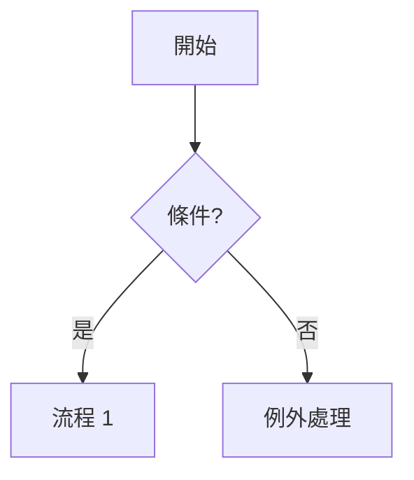
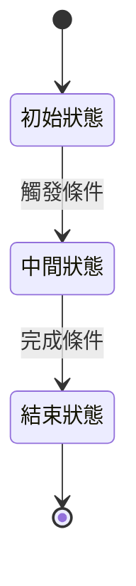

# [工具名稱] Spec

> **這是空白範本**。W3 spec 定稿時填用,課後也可以拿去你自己工作中試用。每段的 blockquote 是填寫指引,寫完後可以保留或刪除。
> 配合自學包 [m5-sdd.md](m5-sdd.md) 一起用。

---

## 目的

> 一句話:這個工具**解決什麼問題、為誰**。
> 壞例:「打造 XX 系統」(這是 what,不是 why)
> 好例:「讓客服在客訴中能 30 秒內取得客戶背景,減少跨系統翻找」

[填寫]

---

## Stakeholder

> 列出**會用 / 會被影響 / 會批准 / 不會主動上場但有 stake** 的所有角色。
> 漏「不會主動上場但有 stake」的(維運、合規、稽核、未來接手的人)= AI 把錯的東西做得很漂亮的常見起點。

| 角色 | 主要關心 | 不主動講但會在意 |
|---|---|---|
| [角色 A] | [主要關心] | [隱性顧慮] |
| [角色 B] | [主要關心] | [隱性顧慮] |

---

## 用例 / 使用情境

> Happy path **+ 至少 2 個例外情境**。只寫 happy path = 沒寫。

1. **Happy path**:[流程]
2. **例外 1**:[查不到 / 權限不足 / 資料過舊 / ...]
3. **例外 2**:[超時 / 重試 / 邊界值 / ...]

---

## 功能需求

> 編號、可獨立驗收、標 MoSCoW(Must / Should / Could / Won't have this time)。
> 一條需求對應一條(或多條)驗收條件。

| ID | 描述 | MoSCoW | 主要 Stakeholder |
|---|---|---|---|
| R1 | [描述] | M | [角色] |
| R2 | [描述] | S | [角色] |
| ... | ... | ... | ... |

---

## 非功能需求

> 效能 / 安全 / 可用性 / 合規——AI 最容易補錯的部分,**省略 = AI 自己想一個**。
> 沒有不寫,有就寫具體(P95、% SLA、合規條款名稱)。

- **效能**:[例:列表頁 P95 ≤ 800ms,1 萬筆資料情境]
- **安全**:[例:客服角色不可見身分證後 4 碼;查詢寫 audit log]
- **可用性**:[例:可用性 ≥ 99.5%,計畫內維護除外]
- **合規**:[例:遵循 X 法規第 Y 條;個資存取需記錄目的]

---

## 設計

> 三視角中**至少 2 個** + Mermaid 內嵌。圖只畫 3 個元素以上 + 有關係的東西,線性流程列點就好。

### 資料

```mermaid
classDiagram
    class [概念 A] {
        [屬性]
    }
    class [概念 B] {
        [屬性]
    }
    [概念 A] "1" --> "*" [概念 B]
```

### 流程



### 狀態(如需要)



---

## 驗收條件

> 對每條功能需求,給**可執行**的驗收條件。Given / When / Then 是最直接的格式。
> 壞例:「客服覺得好用」
> 好例:「Given 客戶 A 已存在 / When 客服 B 輸入 A 的姓名查詢 / Then 顯示 A 的基本資料 + 近 6 個月互動歷史」

| ID | 對應需求 | 驗收條件(Given / When / Then) | 邊界情境 |
|---|---|---|---|
| T1.1 | R1 | Given ... / When ... / Then ... | [邊界:0 筆 / 1 萬筆] |
| T1.2 | R1 | Given ... / When ... / Then ... | [邊界:查不到] |
| ... | ... | ... | ... |

---

## 限制條件

> 技術、合規、時程、資源——不只技術限制。
> 壞例只列「用 X 語言寫」;好例會包括「合規不允許跨境傳輸客戶資料」、「上線時程鎖在 Q3 結束前」、「現有資料庫團隊只能撥 0.5 人」。

- **技術**:[已有技術棧 / 不可換項目]
- **合規**:[必遵守的法規 / 內部政策]
- **時程**:[deadline / 不可動的里程碑]
- **資源**:[團隊 / 預算 / 外部依賴]

---

## 開放問題 / TBD

> **這段很重要,不要藏起來**。沒想清楚的、需要回 stakeholder 問的、現在做不出決定的——全列在這裡。
> 讀的人(同事或 AI)看到 TBD,知道「這裡作者不確定」;你藏起來,讀的人會以為你想清楚了。

- [ ] [問題 1] — 需向 [角色] 確認
- [ ] [問題 2] — 待 [時間 / 條件] 後決定
- [ ] [問題 3] — 兩個方案 A / B 並陳,待取捨

---

## Traceability

> 三層對齊。寫完 spec 做一張這種表,漏掉的會浮出來。

| 需求 ID | 規格段落 | 驗收 ID |
|---|---|---|
| R1 | §功能需求 R1 + §設計-流程 | T1.1, T1.2 |
| R2 | §功能需求 R2 + §設計-資料 | T2.1 |
| ... | ... | ... |

---

### 填寫小提醒

- **用詞**:修改 / 新增 / 異動 / 配合 / 優化 / 適當 / 友善 / 彈性 ——這些詞會被不同人解讀成不同事,AI 也會。用得到就寫具體。
- **寫完問自己**:這份丟給一個不認識專案的工程師(或 AI),他能不能照著做?
- **改了任何一段**,記得回頭同步 Traceability 表——這是迭代不失控的關鍵。
- **TBD 不是丟臉的事**,藏起來才是。
