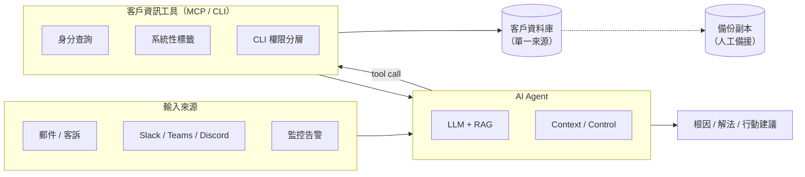

## 訪談紀錄 - SRE 團隊

### SASHA

**Q：PCI 儲存資料有沒有規範上的疑慮？**
A：要看實際做法才能判斷，儲存層大概需要加解密，個資部分可能還要客戶授權。

### Andrew

**Q：資料備援怎麼處理？**
A：等架構跟成本確認後再決定。

### Kyson

**Q1：Tool 或 AI Agent 之間溝通會加密嗎？**
A：都在同一個 domain 內，不需要。

### Ray

**Q：AI 到 tool 之間的渠道有什麼處理？**
A：API 限流、呼叫次數、成功率監控，另外還有 AI token 用量的控制與告警。

### Jesse

**Q：資料同步問題怎麼處理？**
A：資料只有一份放資料庫，沒有同步問題。

### Diego

**Q：這整個 AI 專案希望幫 SRE 做到什麼？**
A：

1. 能自動處理，或依照我們規範的格式跟條件發出通知
2. 風險處理分層：低風險可直接執行，其他層級改為通知 + 人工確認

### Chloe

**Q：如果什麼都要砍，最後哪個不能妥協？**
A：要等實際壓測跟架構評估結果再說。

---

## 訪談紀錄 - ACS / 3DSS 主要負責人

### Sasha

**Q：客戶資訊窗口的維護間隔大概多久確認一次？**
A：也許一季。

### Kyson（客戶資訊工具 - 問題分類）

**Q1：回覆客戶的資料分幾類：常見問題、複雜問題、耗時問題、高風險問題，目前有沒有處理紀錄可以提供？**
A：目前沒有，但可以整理出來。

**Q2：如果要設計客戶標籤，影響 AI 的回覆方式，標籤設計方向是？**
A：主要做系統性分類，排除人為判斷的彈性。

### Andrew

想了解客戶資訊的取得方式。

### Ryan

**Q：怎麼區分哪些客戶可以看到哪些資訊？**
A：透過 CLI 的權限分層來控制。

### RAY

**Q：會限制客戶端聯繫人數限量，避免客戶所有人都可以問嗎?**
A：現行誰問就誰答，無上限，後續思考過通常不會被濫用，人數其實都不多
**Q：如果不在客戶資訊工具清單裡面的人，提出問題，如何判斷是不是真人**
A：一樣人工，因為本身客戶資訊工具就是人維護的。

### jesse

**Q：開發客戶資訊工具 時程優先度高跟低**
A：客戶資訊工具最先，因為其他工具有了，不知道客戶是誰就沒用
**Q1：定義優先開發的功能，後續再增刪**
A：對

### allan

**Q：回覆會依照客戶訊息風格有所差異嗎**
A：回覆語氣固定，但是可能會影響優先及?

### chloe

**Q：客戶資訊工具掛掉，怎麼備援**
A：平常備份到其他地方，到時依照資料人工回覆

### 其他討論反思：AI 與 Tool 是否放在一起？

目前沒有放在一起，那訊息一定要做處理。問題是：每個 tool 各自處理，還是 tool 這邊有一個統一入口跟 AI Agent 對接？

兩種流程方向：

- 訊息 → AI → 客戶資訊工具 → AI → 調用其他工具
- 訊息 → 客戶分層工具 → 客戶資訊工具 → AI → 調用其他工具 → AI

---

## 客戶資訊工具 — 簡單設計架構

> 對應願景圖「Tools / MCP / CLI」中的 **客戶資訊工具**（優先開發）。其他工具（3DS 交易分析等）需先知道「是誰的客戶」才有意義。

### 定位

客戶資訊工具是 AI Agent 生態中的**基礎識別層**：收到訊息後，先解析寄件人／客戶身分，回傳可查詢範圍、標籤與聯絡窗口，再讓 Agent 決定後續要調用哪些工具。

### 架構概覽




### 核心模組


| 模組    | 職責                         | 訪談對齊         |
| ----- | -------------------------- | ------------ |
| 身分查詢  | 依寄件人 email／帳號對應客戶與聯絡窗口     | 清單外來信 → 人工處理 |
| 系統性標籤 | 客戶分類（非人為彈性），影響 AI 回覆策略／優先序 | Kyson Q2     |
| 權限分層  | 透過 CLI 控制「誰能看到哪些欄位」        | Ryan         |
| 資料維護  | 人工維護窗口資訊，約一季確認一次           | Sasha        |
| 備援    | 平常備份至他處；工具不可用時改人工回覆        | Chloe        |


### 與 Agent 的對接方式（待決）

```
方案 A：訊息 → AI → 客戶資訊工具 → AI → 其他工具
方案 B：訊息 → 客戶分層 → 客戶資訊工具 → AI → 其他工具
```

不論哪種，Tool 與 Agent 同 domain 內通訊，不需額外加密；API 需限流、成功率與 token 用量監控。

### 第一版範圍（MVP）

1. 客戶／聯絡人查詢與比對
2. 系統性標籤（初版分類即可，後續增刪）
3. CLI 權限分層讀取
4. 備份機制與人工 fallback 流程

其餘（問題分類統計、回覆語氣差異、聯絡人數量上限等）列為後續迭代。