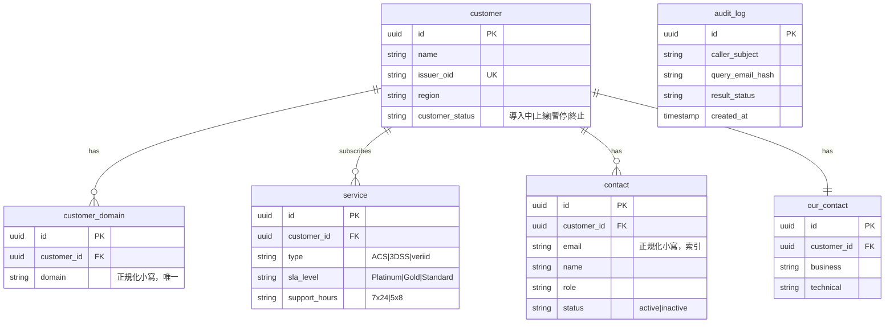
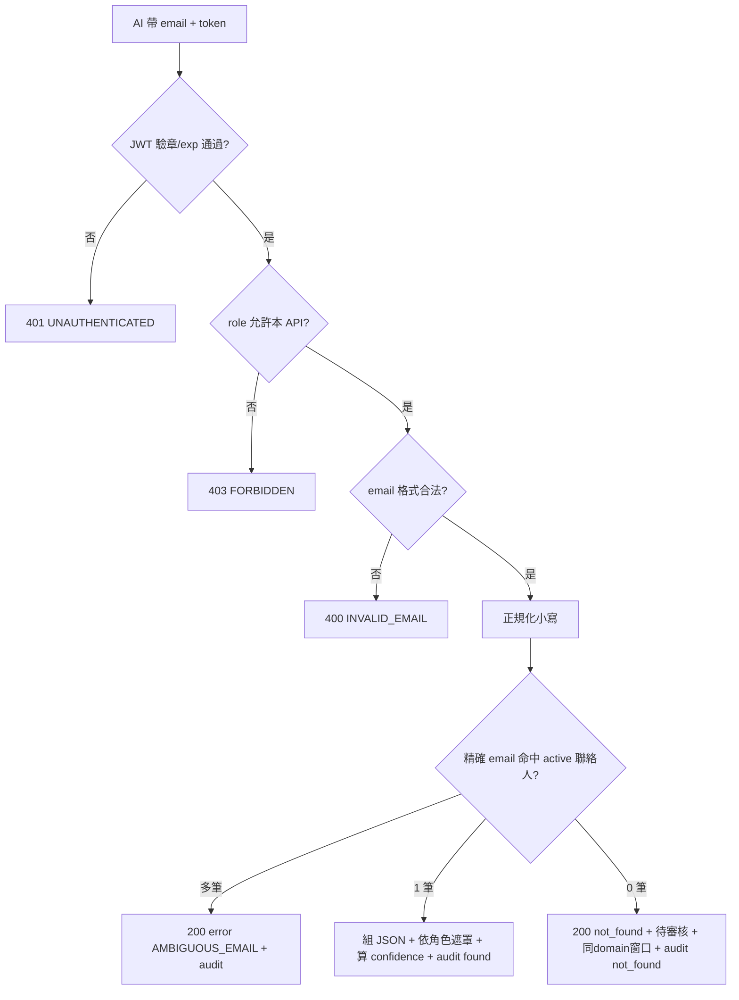

# 客戶資訊工具 — email 查詢 Spec

> **範圍**：AI Agent 用寄件人 email 反查單筆客戶這條最高頻路徑，含資料模型、API 契約、遮罩／可信度演算法，目標是 AI 讀完能直接實作、不需腦補。
> **寫法依據**：NFR 織進每條驗收的 Then；凡是會讓 AI 自行假設的點，一律給明確規則或標 TBD。

---

## 目的

讓 AI Agent 收到客訴 email 時，帶**寄件人 email**呼叫 API，在秒級時間內取得**結構化 JSON**（客戶身分、服務、SLA、聯絡窗口），作為後續 Summary 與工具鏈的識別起點。本服務僅做 DB 唯讀查詢，不含後台維護、批次、Summary 產生。

### 範疇邊界

| ✅ 本服務做 | ❌ 不在本服務範圍 |
|---|---|
| 寄件人 email 反查單筆客戶 | WeChat／Teams 群組辨識 |
| domain + 名單比對 | 後台 UI、匯入匯出、批次修改 |
| 固定欄位 JSON 回傳 | AI Summary、回覆模板 |
| 查無／無權限／格式錯誤處理 | 資料異動與 Approve 流程 |
| 查詢 audit log | 監控告警、備援匯出 |

---

## Stakeholder（本線相關）

| 角色 | 主要關心 |
|---|---|
| 雲服務維運／值班 | 查得快、查得準；查無時知道下一步 |
| AI Agent（呼叫方） | JSON 欄位固定、語意一致、只讀 |
| 服務 Owner | 資料正確、防詐騙（不在名單不自動歸戶） |
| 資安／稽核 | 個資保護、每次查詢可追責 |

---

## 用例

1. **Happy path**：客訴 email 進來 → AI 帶寄件人 email + 授權 token 呼叫 `GET /api/v1/customers/by-email` → 工具正規化 email、比對是否在聯絡人名單且 domain 屬已知客戶 → 回傳固定 JSON（含服務、SLA、active 聯絡人）→ 寫查詢 audit log。
2. **例外 1（查無／不在名單）**：email 不在名單 → 回 `status=not_found`（HTTP 200）+ 結構化提示 + 標 `待審核_潛在客戶` + 列同 domain 既有窗口；**不自動歸戶**。
3. **例外 2（無權限）**：token 無效／過期／未授權 → HTTP 401 或 403，回應 body **不洩漏客戶是否存在**。
4. **例外 3（參數錯誤）**：email 空值或格式不合法 → HTTP 400 + 錯誤碼，不回傳任何客戶資料（記失敗 audit）。

---

## 功能需求

| ID | 描述 | MoSCoW |
|---|---|---|
| R1.1 | 以寄件人 email 反查單筆客戶基本資料 | M |
| R1.2 | 比對寄件人 email domain 是否屬該客戶已知 domain | M |
| R1.3 | 命中時回傳該客戶訂閱服務（ACS／3DSS／veriid）及 SLA，並彙總全戶最嚴格 SLA | M |
| R1.4 | 查無／不在名單 → 結構化提示 + 待審核標記 + 同 domain 窗口清單 | M |
| R1.5 | API 回傳固定 JSON schema；非法參數回標準錯誤碼 | M |
| R1.6 | 本 API 僅允許讀取；不提供寫入端點 | M |
| R1.7 | 每次成功／失敗查詢寫 audit log | M |
| R1.8 | 依呼叫方角色決定敏感欄位是否遮罩 | M |

---

## 技術契約

### A. 技術棧（基準假設，可由團隊覆寫）

| 項目 | 選定 | 備註 |
|---|---|---|
| 語言／框架 | Python 3.12 + FastAPI | 團隊熟悉度；若改 Java/Spring Boot 需同步調整範例 |
| 資料庫 | MySQL 8.0 | DB only；UUID 主鍵以 `BINARY(16)`（或 `CHAR(36)`）儲存 |
| 存取層 | SQLAlchemy 2.x（參數化查詢，禁字串拼接 SQL） | 防注入 |
| 部署 | GCP + K8S（單一唯讀服務） | 已拍板 GCP |
| 認證 | Bearer Token（JWT），於 `Authorization` header 帶入 | 見 D |

> 標「基準假設」表示：未經團隊推翻前，AI 即依此實作；推翻時只改本表與受影響範例。

### B. 資料模型（DB schema）



- `contact.email`、`customer_domain.domain` 建立索引；查詢一律用正規化後的小寫值比對。
- 共用型 domain（gmail.com、outlook.com 等）放 `excluded_domains` 設定表，命中時**不**做 domain 推定（僅走精確 email 名單比對）。

### C. email 與 domain 比對規則

1. **正規化**：輸入 email 去除前後空白、轉小寫。domain = `@` 之後字串。
2. **精確命中**：正規化 email 完全等於某 `contact.email` 且該 contact `status=active` → 命中其 `customer_id`。
3. **domain 比對**：取出 domain，若屬某客戶的 `customer_domain` 且不在 `excluded_domains` → 該客戶為候選；email 不在名單時走 R1.4（查無 + 列同 domain 窗口），**不**因 domain 命中就視為已歸戶。
4. **inactive 聯絡人**：精確命中但 `status=inactive` → 視為查無（走 R1.4），`hints` 提示「窗口已停用」。
5. **多客戶同 email**（資料異常）→ 回 `status=error`、`error_code=AMBIGUOUS_EMAIL`，寫 audit 供人工清理。

### D. API 契約

```
GET /api/v1/customers/by-email?email={email}
Header: Authorization: Bearer <JWT>
```

- **JWT 內含**：`sub`（呼叫主體）、`role`（`Admin` | `Viewer` | `Agent`）、`exp`。token 由內部 SSO／IdP 簽發，本服務僅驗章 + 驗 exp + 驗 role 是否允許本 API。
- **允許呼叫角色**：`Admin`、`Agent`、`Viewer` 皆可查；遮罩程度依角色（見 F）。
- **HTTP 狀態碼對照**：

| 情境 | HTTP | body `status` | `error_code` |
|---|---|---|---|
| 命中 | 200 | `found` | — |
| 查無／不在名單／inactive | 200 | `not_found` | — |
| email 空值／格式錯 | 400 | `error` | `INVALID_EMAIL` |
| 缺 token／JWT 驗章失敗 | 401 | `error` | `UNAUTHENTICATED` |
| token 有效但角色不允許 | 403 | `error` | `FORBIDDEN` |
| 同 email 對到多客戶 | 200 | `error` | `AMBIGUOUS_EMAIL` |
| 下游 DB 逾時／異常 | 503 | `error` | `BACKEND_UNAVAILABLE`（可重試） |

> 401／403／400 的 body 僅含 `status` 與 `error_code`，**不含任何客戶欄位**，避免存在性洩漏。

### E. 固定 JSON 回傳（status=found）

```json
{
  "schema_version": "1.0",
  "status": "found",
  "customer": {
    "name": "string(依角色遮罩)",
    "issuer_oid": "string",
    "region": "string",
    "customer_status": "導入中|上線|暫停|終止"
  },
  "services": [
    { "type": "ACS|3DSS|veriid", "sla_level": "Platinum|Gold|Standard", "support_hours": "7x24|5x8" }
  ],
  "effective_sla_level": "Platinum|Gold|Standard",
  "contacts": [
    { "name": "string(依角色遮罩)", "role": "string", "email": "string(依角色遮罩)", "status": "active|inactive" }
  ],
  "our_contacts": { "business": "string", "technical": "string" },
  "review_tag": null,
  "same_domain_contacts": [],
  "hints": [],
  "data_confidence": "high|medium|low"
}
```

- `effective_sla_level`：全戶所有 `services` 取最嚴格（嚴格序：`Platinum > Gold > Standard`）。無服務時為 `null`。
- `not_found` 時：`customer`／`services`／`our_contacts` 為 `null`，`review_tag="待審核_潛在客戶"`，`same_domain_contacts` 填值，`hints` 含提示。
- `same_domain_contacts` item schema：`{ "name": "string(遮罩)", "role": "string", "email": "string(遮罩)", "customer_name": "string" }`。

### F. 遮罩演算法（依角色）

| 角色 | name | email | issuer_oid／region |
|---|---|---|---|
| `Admin` | 明文 | 明文 | 明文 |
| `Agent` | 遮罩 | 遮罩 | 明文 |
| `Viewer` | 遮罩 | 遮罩 | 明文 |

- **name 遮罩**：保留首字，其餘以 `*` 取代（`王小明` → `王**`；單字 `李` → `李`）。
- **email 遮罩**：local part 保留首字，其餘 `*`；domain 完整保留（`alice@a-bank.com` → `a****@a-bank.com`；單字 local → 該字 + `*`）。
- 遮罩在**回傳序列化前**套用；DB 儲存層 email／name 不明碼（ISO-27001 導入後再上欄位加密）。

### G. data_confidence 計算規則

| 條件 | 值 |
|---|---|
| 精確 email 命中 + 至少 1 筆 active 服務 + 有我方窗口 | `high` |
| 命中但缺服務或缺我方窗口（資料不全） | `medium` |
| 無 active 服務，或僅靠 domain 推定（不歸戶，多為 not_found） | `low` |

---

## 設計流程



---

## 驗收條件

> 效能／安全／稽核／授權寫在 Then。

| ID | 對應需求 | 驗收條件（Given / When / Then） | 邊界情境 |
|---|---|---|---|
| T1.1 | R1.1 | Given DB 有客戶 A、active 聯絡人 `alice@a-bank.com` / When `Agent` 角色帶有效 JWT 查 `alice@a-bank.com` / Then HTTP 200、`status=found`、含 A 的 `name`(遮罩)／`issuer_oid`／`region`／`customer_status`；**P95 ≤ 2s**（規模：約 300 家、約 3000 筆聯絡人、低併發）；**寫 audit**（caller_subject、email hash、timestamp、result=found） | `Alice@A-Bank.com` 大小寫不同須命中同筆 |
| T1.2 | R1.2 | Given 客戶 A 的 `customer_domain` 含 `a-bank.com`、`bob@a-bank.com` 在名單且 active / When 查詢 / Then 判定客戶 A；**CC 其他未知收件人不影響判定** | domain 命中但 email 不在名單 → 走 T1.4，不歸戶 |
| T1.3 | R1.3 | Given 客戶 A 訂閱 ACS(Gold) 與 3DSS(Platinum) / When 命中 / Then `services` 含兩筆、各帶 `sla_level`，且 `effective_sla_level=Platinum` | 無服務 → `services=[]`、`effective_sla_level=null`、`data_confidence=low` |
| T1.4 | R1.4 | Given `stranger@unknown.com` 不在名單 / When 查 / Then HTTP 200、`status=not_found`、`review_tag=待審核_潛在客戶`、`hints` 含「檢查舊資料／建立新資料／轉人工」、`same_domain_contacts` 依 schema 列同 domain 既有窗口；**不自動建客戶或歸戶**；寫 audit(result=not_found) | 空字串 email → 400 INVALID_EMAIL，不算查無 |
| T1.5 | R1.5 | Given 合法 token / When 帶合法 email / Then body 完全符合 §E schema（欄位名稱、型別、`schema_version`）；When email 格式非法 / Then HTTP 400 + `error_code=INVALID_EMAIL`，**不 partial 回傳客戶資料** | DB 逾時 → 503 + `BACKEND_UNAVAILABLE` |
| T1.6 | R1.6 | Given 服務僅註冊 GET 端點 / When 對 `/api/v1/customers/by-email` 發 POST／PUT／DELETE / Then HTTP 405，**DB 無任何寫入** | — |
| T1.7 | R1.7 | Given 任一請求（含 400／401／403／200） / When 結束 / Then `audit_log` 有列：caller_subject、`query_email_hash`（雜湊非明文）、result_status、created_at；**log 不含個資明文** | — |
| T1.8 | R1.8 | Given 呼叫者角色為 `Viewer` / When 查含姓名／email 的客戶 / Then 回傳 `name`、`email` 依 §F 遮罩（`王**`、`a****@a-bank.com`）；Given 角色為 `Admin` / Then 同欄位回明文 | 無 token／驗章失敗 → 401，body 不含客戶欄位 |
| T1.9 | R1.5, R1.8 | Given 約 3000 筆聯絡人載入 / When 連續 50 次單筆查詢（低併發） / Then **P95 ≤ 2s、P99 ≤ 5s**，且每次皆寫 audit | 壓測資料量與正式量差異須記錄 |
| T1.10 | C 規則 5 | Given 同一 email 異常對應到 2 個客戶 / When 查詢 / Then HTTP 200、`status=error`、`error_code=AMBIGUOUS_EMAIL`，寫 audit 供人工清理 | — |
| T1.11 | C 規則 4 | Given `carol@a-bank.com` 存在但 `status=inactive` / When 查詢 / Then 走 not_found，`hints` 含「窗口已停用」 | — |

---

## 限制條件

- **技術**：DB only（MySQL 8.0）；部署 GCP + K8S；唯讀服務，無寫入端點；參數化查詢防注入。
- **合規**：不存 token／卡號；個資（email／姓名）回應依角色遮罩；audit 存 email 雜湊不存明文；每次查詢留痕。
- **規模假設**：約 300 家客戶、每家 8–10 聯絡人（**待 Kyson 確認**）；觸發式低併發；效能目標 P95 ≤ 2s。

---

## 開放問題 / TBD

- [ ] **domain 符合但人不在名單**：本 spec 採「不自動歸戶」— 待主管確認是否調整。
- [ ] **excluded_domains 清單內容**：哪些共用 domain 要排除推定 — 待 Owner／資安提供。
- [ ] **P95 2s 是否再收緊**：VIP 客戶是否需更嚴 SLO — 待 Owner 劃線。
- [ ] **JWT 簽發與 role 對應**：IdP 來源、role 與後台 RBAC 是否同一套 — 待主管／後續整合對齊。
- [ ] **效能目標的硬體基準**：P95 2s 對應的 instance 規格 — 待預算拍板。

---

## Traceability

| 需求 | 規格段落 | 驗收 |
|---|---|---|
| R1.1 | §C、§E | T1.1 |
| R1.2 | §C | T1.2 |
| R1.3 | §E(effective_sla_level) | T1.3 |
| R1.4 | §C、§E | T1.4, T1.11 |
| R1.5 | §D、§E | T1.5, T1.9, T1.10 |
| R1.6 | §D | T1.6 |
| R1.7 | §B(audit_log) | T1.7 |
| R1.8 | §F | T1.8 |
