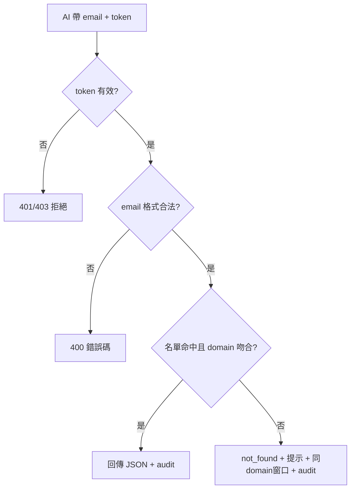

# 客戶資訊工具 — 第一階段局部 Spec（email 查詢這條線）

> **定位**：W3 第一階段作業。只覆蓋「AI Agent 用寄件人 email 反查單筆客戶」這條最高頻路徑。
> **完整版**見 [kyson_w3-spec.md](kyson_w3-spec.md)（第二階段，涵蓋全工具）。
> **寫法依據**：NFR 不單獨飄在清單，織進每條驗收的 Then。

---

## 目的

讓 AI Agent 收到客訴 email 時，帶**寄件人 email**呼叫 API，在短時間內取得**結構化 JSON**（客戶身分、服務、SLA、聯絡窗口），作為後續 Summary 與工具鏈的識別起點。第一階段僅 DB 查詢，不含後台維護、批次、Summary 產生。

### 範疇邊界（本文件）

| ✅ 本階段做 | ❌ 本階段不做（見完整 spec） |
|---|---|
| 寄件人 email 反查單筆客戶 | WeChat／Teams 群組辨識 |
| domain + 名單比對 | 後台 UI、匯入匯出、批次修改 |
| 固定欄位 JSON 回傳 | AI Summary、回覆模板 |
| 查無／無權限／格式錯誤處理 | 資料異動與 Approve 流程 |
| 查詢 audit log | 監控告警、備援匯出 |

---

## Stakeholder（本線相關）

| 角色 | 主要關心 |
|---|---|
| 雲服務維運／值班 | 查得快、查得準；查無時知道下一步 |
| AI Agent（呼叫方） | JSON 欄位固定、語意一致、只讀 |
| 服務 Owner | 資料正確、防詐騙（不在名單不自動歸戶） |
| 資安／稽核 | 個資保護、每次查詢可追責 |

---

## 用例

1. **Happy path**：客訴 email 進來 → AI 帶寄件人 email + 授權 token 呼叫 `GET /customers/by-email` → 工具比對 email 是否在名單且 domain 屬已知客戶 → 回傳固定 JSON（含服務、SLA、active 聯絡人）→ 寫查詢 audit log。
2. **例外 1（查無／不在名單）**：email 不在聯絡人名單 → 回 `not_found` + 結構化提示（檢查舊資料／建立新資料／轉人工）+ 標 `[待審核_潛在客戶]` + 列同 domain 既有窗口供照會；**不自動歸戶**。
3. **例外 2（無權限）**：token 無效、過期或未授權此 API → HTTP 401/403，不洩漏客戶是否存在。
4. **例外 3（參數錯誤）**：email 空值或格式不合法 → HTTP 400 + 錯誤碼，不寫入客戶資料查詢結果（可記失敗 audit）。

---

## 功能需求

| ID | 描述 | MoSCoW | 對應完整 spec |
|---|---|---|---|
| R1.1 | 以寄件人 email 反查單筆客戶基本資料 | M | R1 |
| R1.2 | 比對寄件人 email domain 是否屬該客戶已知 domain | M | R2（email 部分） |
| R1.3 | 命中時回傳該客戶訂閱服務（ACS／3DSS／veriid）及 SLA | M | R3 |
| R1.4 | 查無／不在名單 → 結構化提示 + 待審核標記 + 同 domain 窗口清單 | M | R4 |
| R1.5 | API 回傳固定 JSON schema；非法參數回標準錯誤碼 | M | R13 |
| R1.6 | 本 API 僅允許讀取；不提供寫入端點 | M | R14 |
| R1.7 | 每次成功／失敗查詢寫 audit log | M | R19 |
| R1.8 | 依呼叫方角色決定敏感欄位是否遮罩 | M | R18 |

---

## 設計

### 固定 JSON 回傳欄位（R1.5）

```json
{
  "status": "found | not_found | error",
  "customer": {
    "name": "string",
    "issuer_oid": "string",
    "region": "string",
    "customer_status": "導入中|上線|暫停|終止"
  },
  "services": [
    { "type": "ACS|3DSS|veriid", "sla_level": "Platinum|Gold|Standard", "support_hours": "7x24|5x8" }
  ],
  "contacts": [
    { "name": "string(遮罩)", "role": "string", "email": "string(遮罩)", "status": "active|inactive" }
  ],
  "our_contacts": { "business": "string", "technical": "string" },
  "review_tag": "待審核_潛在客戶 | null",
  "same_domain_contacts": [],
  "hints": ["string"],
  "data_confidence": "high|medium|low"
}
```

### 流程



---

## 驗收條件

> 效能／安全／稽核／授權寫在 Then，不另開浮動 NFR 清單。

| ID | 對應需求 | 驗收條件（Given / When / Then） | 邊界情境 |
|---|---|---|---|
| T1.1 | R1.1 | Given DB 有客戶 A、聯絡人 `alice@a-bank.com` 為 active / When AI 以有效 token 帶 `alice@a-bank.com` 查詢 / Then 回 `status=found`、含 A 的 `name`／`issuer_oid`／`region`／`customer_status`；**端對端 ≤60s**（規模假設：約 300 家客戶、~3000 筆聯絡人）；**寫入 audit**（caller_id、查詢 email、timestamp、結果=found） | email 大小寫不同應視為同一筆 |
| T1.2 | R1.2 | Given 客戶 A 的允許 domain 為 `a-bank.com`、寄件人 `bob@a-bank.com` 在名單 / When 查詢 / Then 判定為客戶 A；**CC 其他未知收件人不影響判定** | domain 不符已知客戶 → 視同查無（走 T1.4） |
| T1.3 | R1.3 | Given 客戶 A 同時訂閱 ACS 與 3DSS / When 命中查詢 / Then `services` 陣列含兩筆且各自帶 `sla_level`；多 SLA 時回傳值取**最嚴格**等級 | 無訂閱服務 → `services=[]` 且 `data_confidence=low` |
| T1.4 | R1.4 | Given `stranger@unknown.com` 不在任何名單 / When 查詢 / Then 回 `status=not_found`、`review_tag=待審核_潛在客戶`、`hints` 含「檢查舊資料／建立新資料／轉人工」、`same_domain_contacts` 列出同 domain 既有窗口；**不自動建立客戶或歸戶**；**寫 audit**（結果=not_found） | 空字串 email → 400，不當成查無 |
| T1.5 | R1.5 | Given 合法 token / When 帶合法 email 查詢 / Then HTTP 200 且 body 符合上節 JSON schema（欄位名稱與型別固定）；When 帶非法 email 格式 / Then HTTP 400 + `error_code` + 訊息，**不 partial 回傳客戶資料** | 逾時 → 5xx + 可重試標記（實作細節 TBD） |
| T1.6 | R1.6 | Given 僅開放本 spec 定義的查詢 API / When AI 嘗試 POST／PUT／DELETE 客戶資料 / Then HTTP 405 或 403，**資料庫無異動** | — |
| T1.7 | R1.7 | Given 任一成功或失敗查詢（含 400／401／403） / When 請求結束 / Then audit 表有紀錄：**誰（token 對應主體）、何時、查詢參數（email）、結果狀態**；**不記錄完整個資明文於 log** | — |
| T1.8 | R1.8 | Given 呼叫方角色為 Viewer（不可見完整個資） / When 查詢含姓名、email、手機的客戶 / Then 回傳 JSON 中姓名、email **遮罩**（如 `王*明`、`a***@a-bank.com`）；DB 儲存層 **email／姓名不明碼**（ISO-27001 導入前：至少應用層遮罩 + 存取控管） | 無 token 或 token 無效 → 401，不回任何客戶欄位 |
| T1.9 | R1.5, R1.8 | Given 約 3000 筆聯絡人資料已載入 DB / When 連續 10 次單筆 email 查詢（低併發） / Then **每次 P95 回應 ≤60s**；每次皆寫 audit | 壓測環境與正式資料量待確認 |

---

## 限制條件

- **技術**：第一階段 DB only；部署 GCP（已拍板）；API 供 AI Agent 同 domain 呼叫。
- **合規**：不存 token／卡號；個資（email／姓名）查詢回應依角色遮罩；每次查詢留痕。
- **規模假設**：約 300 家客戶、每家 8–10 聯絡人（**待 Kyson 確認**）；觸發式低併發。

---

## 開放問題 / TBD

- [ ] **domain 符合但人不在名單**：本 spec 採「不自動歸戶」— 待主管確認是否調整。
- [ ] **P95 60s 是否過寬**：Owner 期望「短於人工自查」— 壓測後可能收緊至 10s 級。
- [ ] **JSON schema 版本化**：欄位增刪是否用 `schema_version` 欄位 — 待與 AI 整合方確認。

---

## Traceability

| 本文件需求 | 完整 spec | 本文件驗收 |
|---|---|---|
| R1.1 | R1 | T1.1 |
| R1.2 | R2 | T1.2 |
| R1.3 | R3 | T1.3 |
| R1.4 | R4 | T1.4 |
| R1.5 | R13 | T1.5, T1.9 |
| R1.6 | R14 | T1.6 |
| R1.7 | R19 | T1.7 |
| R1.8 | R18 | T1.8 |
