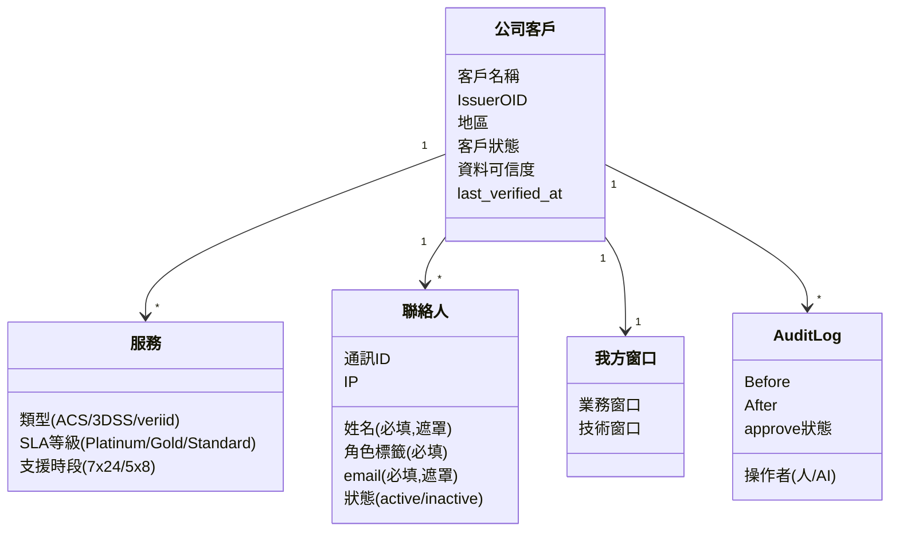
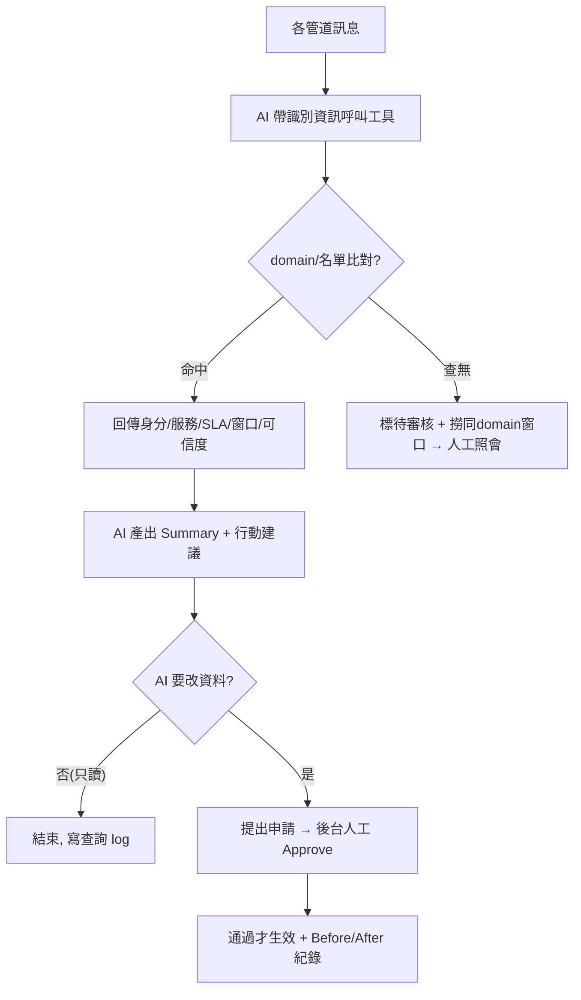

# 客戶資訊工具 Spec（Kyson · W3 定稿）

> 來源：A／B／C 三組衝突裁決 + 全部 11 份訪談 + [kyson_w3-需求清單.md](kyson_w3-需求清單.md)。
> 內容標準依 [m5-sdd.md](../01_自學模組/m5-sdd.md)（結構化／無歧義／可驗證），格式依 [spec-template.md](../03_範本/spec-template.md)。
> 規模基準：約 300 家客戶、每家 8–10 聯絡窗口、觸發式低併發（**待確認**）。

---

## 目的

AI Agent 收到各管道（email／WeChat／Teams…）的客訴或告警時，先在短時間內解析「是哪家客戶、用哪個服務（ACS/3DSS）、找哪個窗口」，回傳結構化身分、標籤與行動建議，作為 Agent 調用後續工具的**基礎識別層**——其他工具不知道客戶是誰就沒有意義。

### 範疇邊界
- ✅ 做：身分識別、客戶/聯絡人/服務/SLA 資料查詢與維護、AI Summary、CLI/API 介接、後台維護。
- ❌ 不做（屬其他工具）：歷史問題分析（Developer Site）、對外寄信（郵件處理工具）、API QA。

---

## Stakeholder

| 角色 | 主要關心 | 不主動講但會在意 |
|---|---|---|
| 雲服務維運／值班（使用者） | 查得快查得準、半夜能快速判斷要不要處理 | 查無資料時的下一步；聯絡人太多時找誰 |
| AI Agent（呼叫方） | 拿到結構化身分 + 可信度才能判斷 | 欄位語意一致、只讀邊界清楚 |
| 主管（批准／定範圍） | 範圍、優先序、KPI（人工作業轉 AI 的程度） | 預算上限；bulk query 是否納入 |
| 服務 Owner（Diego/Wayne，第一線責任） | 資料準確、回應快、出事拿得到聯絡名單 | 防詐騙；不能幻想回答 |
| SRE（Kyson，系統可靠度） | 系統活著、合規、可觀測 | 預算決定架構；ISO 加密範圍 |
| 資安／稽核（有 stake，不上場） | PCI/ISO、IP 白名單、異動可追責 | 人改/AI 改的治理一致性 |
| 客戶（被影響） | 個資被保護、不被仿冒 | 誤判已離職窗口 |
| 未來接手者／AI（有 stake） | spec 夠不夠照做 | baseline 有沒有寫全 |

---

## 用例 / 使用情境

1. **Happy path**：客訴 email 進來 → AI 帶寄件人 email 呼叫工具 → 工具比對 domain + 名單 → 回傳客戶身分、服務(ACS/3DSS)、SLA、聯絡窗口、可信度、可見欄位 → AI 產出 Summary(根因/嚴重度/是否立即處理/行動建議) → 全程寫 audit log。
2. **例外 1（查無 / 不在名單）**：回「查無結果」+ 提示（查舊資料/建立新資料），標 `[待審核_潛在客戶]`，撈同 domain 既有窗口供人工照會，**不自動歸戶**。
3. **例外 2（AI 要改資料）**：AI 僅能提出新增/修改/刪除**申請** → 進後台待人工 Approve → 通過才生效並留 Before/After 紀錄。
4. **例外 3（SLA 超時 / 取不到資料）**：AI 先回中性罐頭信或轉真人，依客戶優先等級排序。
5. **例外 4（工具不可用）**：改用唯讀備援（GitLab MD/Excel）人工查。

---

## 功能需求

> 編號、可獨立驗收、標 MoSCoW。對應需求清單 F1–F23。

| ID | 描述 | MoSCoW | 主要 Stakeholder |
|---|---|---|---|
| R1 | 反查單筆客戶 email／基本資料（最高頻 baseline） | M | 使用者／Owner |
| R2 | email domain 辨識客戶；通訊軟體依群組名辨識 | M | 主管 |
| R3 | 自動辨識服務（ACS/3DSS/veriid）並服務配對 | M | 主管 |
| R4 | 查無／不在名單 → Summary 提示 + 轉人工 + 標待審核 | M | 使用者／Owner |
| R5 | 客戶資料模型：公司→服務(SLA 可覆寫)→聯絡人(姓名*/角色*/email*/通訊ID/IP)+我方窗口；含 OID/地區/客戶狀態 | M | 主管／Diego |
| R6 | 聯絡窗口管理：不設上限，需 active/inactive 狀態與角色/優先序 | M | Owner／Ray |
| R7 | 匯入／匯出／批次修改 | M | 主管 |
| R8 | 每筆資料新鮮度欄位（last_verified_at／updated_by／verification_status／stale_flag） | S | Diego／Ryan |
| R9 | 維護排程：預設半年可調，匯出客戶確認後匯回 | S | Owner／主管 |
| R10 | 既定標籤清單：客戶/服務/角色職責/問題四類 | M | Andrew／Ryan |
| R11 | SLA 標籤：公版+客製、分級、多 SLA 取最嚴格 | M | Andrew |
| R12 | 資料可信度標籤，低可信度提示人工驗證 | S | Diego／主管 |
| R13 | CLI／API 供 AI 呼叫，回傳固定格式 | M | AI |
| R14 | **AI Agent 只讀；增刪改需人工 Approve** | M | 主管（全體一致） |
| R15 | AI Summary：角色/職位/是否技術人員+根因+嚴重度+是否立即處理+行動建議 | M | 主管／Ryan |
| R16 | 回覆模板依問題分類套用，發送前人工 review | S | Owner |
| R17 | 後台介面 + SSO + 可維護標籤/規則/資料 | M | 主管／Ryan／Wayne |
| R18 | 權限控管：後台角色 + CLI 權限 + 調用權限，RBAC 可擴充 | M | Ryan／Owner |
| R19 | 操作留痕：後台 Before/After；查詢留痕 | M | 資安／Ryan |
| R20 | 工具不可用 → 唯讀備援 + 人工 | M | Owner／Chloe |
| R21 | 監控 API 頻率/成功率(<80%告警)/latency、系統 CPU/mem/disk、4xx/5xx | M | SRE |
| R22 | AI Token 用量監控，超量 suspend + 告警 | M | SRE |
| R23 | 結構化 Log Summary（OID/地區/執行時間） | S | SRE |

---

## 非功能需求

- **效能**：單筆查詢回應短於人工自查；重大事件通知名單 Owner 底線 ≤ 5 分鐘。
  - 規模假設：約 300 家客戶、每家 8–10 窗口、觸發式低併發。P95 數字待壓測。
  - ⛔ Queue／HA：此規模屬假議題，**預設不做**（A組衝突1）；預算拍板前保留 Priority Queue 為備案（規模成長才啟用）。
- **安全/合規**：不存 token/卡號（避開 PCI，可置 CDE 外）；ISO-27001 導入後個資存 DB 加密/遮罩、異動留紀錄+approve；個資法保護 email/手機/姓名，匯出加密；請求端 IP 白名單。
- **可用性**：定位次要服務，可拉長回應/冷啟動省成本；SLA 超時→AI 回中性罐頭信或轉真人；掛掉→唯讀備援。SLO 數字待定。
- **部署/可觀測性**：GCP + K8S 容錯、單獨模組；監控見 R21–R23。

---

## 設計

### 資料

### 流程（含 AI 只讀 + Approve 治理）

---

## 驗收條件

> 每條 Must 給可執行的 Given / When / Then。

| ID | 對應需求 | 驗收條件（Given / When / Then） | 邊界情境 |
|---|---|---|---|
| T1.1 | R1 | Given 客戶 A 存在 / When AI 帶 A 的 email 查 / Then 回 A 基本資料 + 寫 log | 查不到→T4.1 |
| T2.1 | R2 | Given 寄件人 domain 屬已知客戶 / When 查 / Then 判定為該客戶；CC 未知人不影響判定 | domain 不符→拒絕授信 |
| T3.1 | R3 | Given 客戶 A 訂閱 ACS / When 收到 A 的來信 / Then 回傳服務別=ACS 供 AI 配對處理 | 多服務→全列 |
| T4.1 | R4 | Given email 不在名單 / When 查 / Then 回查無 + 提示 + 標待審核 + 列同 domain 窗口 | 空字串/格式錯 |
| T5.1 | R5 | Given 客戶 A 用 ACS+3DSS / When 查 A / Then 回兩服務及各自 SLA、聯絡人、我方窗口 | 無服務→標 N/A |
| T6.1 | R6 | Given A 有 1 離職窗口 / When 查 A 窗口 / Then 離職窗口標 inactive 不列入主要建議 | 0 窗口→空清單 |
| T7.1 | R7 | Given 業務 X 離職、名下 5 家客戶 / When 批次改窗口為業務 Y / Then 5 筆一次更新且各留 Before/After | 匯入格式錯→拒絕並回報 |
| T10.1 | R10 | Given 標籤清單已定義 / When 對客戶套標籤 / Then 只能選清單內值，不可自由文字 | 未定義標籤→拒絕 |
| T11.1 | R11 | Given A 同時有 Gold 與 Platinum / When 取 SLA / Then 以最嚴格(Platinum)為準 | 無 SLA→公版 |
| T13.1 | R13 | Given AI 經 API 查 / When 帶合法參數 / Then 回固定格式結果並寫 log；非法參數回錯誤碼 | 逾時/限流 |
| T14.1 | R14 | Given AI 提出修改客戶資料 / When 送出 / Then 不直接生效，進後台待 Approve | 未審核前查詢仍見舊值 |
| T15.1 | R15 | Given 命中客戶 / When 產 Summary / Then 含角色/職位/是否技術人員+根因+嚴重度+是否立即處理+行動建議 | 資料不足→附可信度 |
| T17.1 | R17 | Given 維運人員 / When 經 SSO 登入後台 / Then 依角色看到可維護的標籤/資料 | 未授權→拒絕 |
| T18.1 | R18 | Given 角色僅可見非敏感欄位 / When 查含手機客戶 / Then 手機遮罩 | 高權限可見 |
| T19.1 | R19 | Given 後台改一筆資料 / When 儲存 / Then 留 Before/After 紀錄（誰、何時） | 查詢也須留痕 |
| T20.1 | R20 | Given 工具不可用 / When 需查 / Then 可依唯讀備援人工回覆 | 備份過期→標時間 |
| T21.1 | R21 | Given API 成功率跌破 80% / When 監控採樣 / Then 觸發告警 | disk 90%→告警 |
| T22.1 | R22 | Given AI token 用量超警戒 / When 偵測 / Then 自動 suspend + 告警設計者 | — |

---

## 限制條件

- **技術**：GCP + K8S 單獨模組；Tool↔AI 同 domain；CLI 與後台 UI 並存（職責需切清，見開放問題）；部署平台 AWS vs GCP 未定。
- **合規**：不存 token/卡號避開 PCI；ISO-27001 導入後需加密/遮罩 + approve；個資法；自動化動作須可追責（無人可追責者不做，如 AI 自動改防火牆白名單）。
- **時程**：W3（2026/6/18）定稿；第一階段 DB only，RAG 讀合約列第二階段。
- **資源**：SRE 維運；**預算上限未定**（直接卡住架構決策）。

---

## 開放問題 / TBD

- [ ] **預算上限**（最關鍵，決定架構/是否需 Queue/機器規模）— 待主管（escalate）。
- [ ] **domain 符合但人不在名單**：自動歸戶 vs 人工防詐騙 — 待主管講風險（escalate）。
- [ ] **部署平台 AWS vs GCP** — 待主管看價格（escalate）。
- [ ] **ISO-27001 加密/遮罩範圍與 approve 流程** — 待資安/主管（escalate）。
- [ ] **權限一層 vs 兩層、完整角色清單、CLI 與後台是否同套權限** — 待主管/Owner。
- [ ] **Bulk query（看所有 ACS 客戶等分群）是否納入 MVP**：主管未意識 — 待裁決。
- [ ] **審核治理**：人改不審、AI 改要審不一致 → 建議改「操作風險分級」 — 待主管。
- [ ] **Admin 後台 vs 本工具：共用 DB 還是兩套人工同步** — 待架構決定。
- [ ] **AI Summary 是否讀 Developer Site 歷史紀錄判斷重複問題** — scope 待定。
- [ ] **回應時間「短」的底線（2s/10s/1min/5min）、SLO 數字** — 待 Owner/壓測。

---

## Traceability

| 需求 ID | 規格段落 | 驗收 ID |
|---|---|---|
| R1 | §功能 R1 + §設計-流程 | T1.1 |
| R2 | §功能 R2 + §用例-例外2 | T2.1 |
| R3 | §功能 R3 + §用例-Happy | T3.1 |
| R4 | §功能 R4 + §用例-例外2 | T4.1 |
| R5 | §功能 R5 + §設計-資料 | T5.1 |
| R6 | §功能 R6 + §設計-資料 | T6.1 |
| R7 | §功能 R7 + §設計-資料 | T7.1 |
| R10 | §功能 R10 + §設計-資料 | T10.1 |
| R11 | §功能 R11 + §設計-資料 | T11.1 |
| R13 | §功能 R13 + §設計-流程 | T13.1 |
| R14 | §功能 R14 + §用例-例外3 + §設計-流程 | T14.1 |
| R15 | §功能 R15 + §用例-Happy | T15.1 |
| R17 | §功能 R17 + §非功能-安全 | T17.1 |
| R18 | §功能 R18 + §非功能-安全 | T18.1 |
| R19 | §功能 R19 + §設計-資料 | T19.1 |
| R20 | §功能 R20 + §用例-例外4 | T20.1 |
| R21 | §功能 R21 + §非功能-可觀測性 | T21.1 |
| R22 | §功能 R22 + §非功能-可觀測性 | T22.1 |
| R8, R9, R12, R16, R23 | §功能（Should） | 待補（次優先） |

> ✅ 全部 18 條 Must 皆已對應驗收條件。Should（R8/R9/R12/R16/R23）驗收次優先，留待課堂補。
> ⚠️ 多條 T 的具體數字（回應秒數、SLO、可信度過期天數）依開放問題拍板後才能定。
