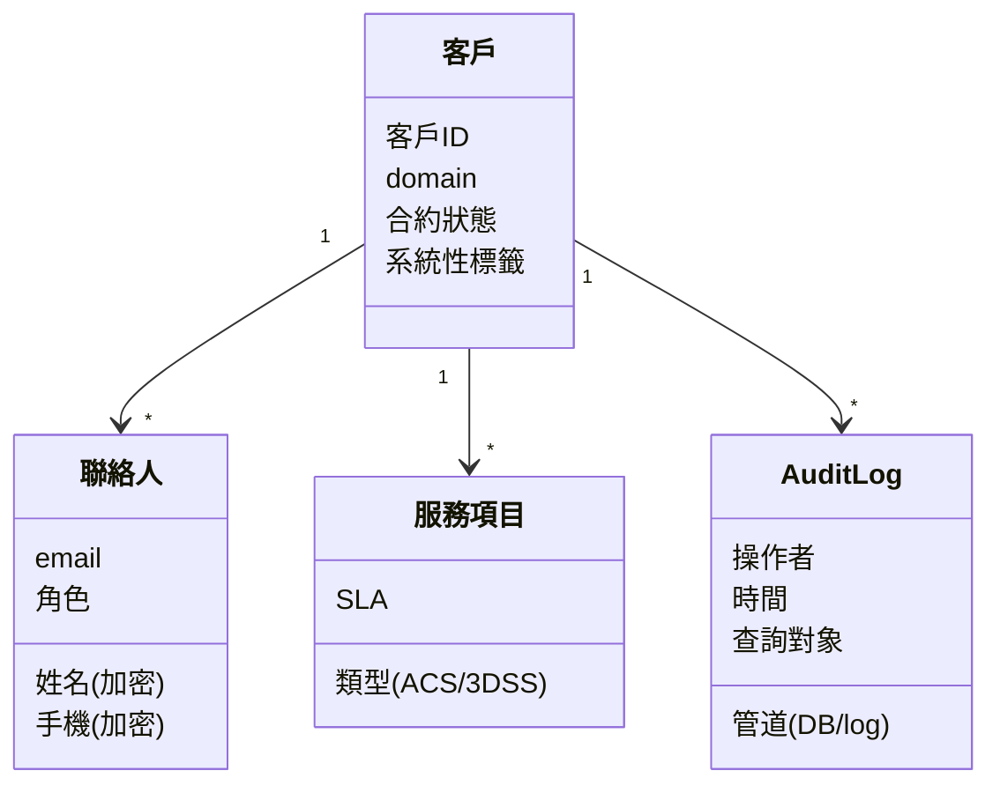
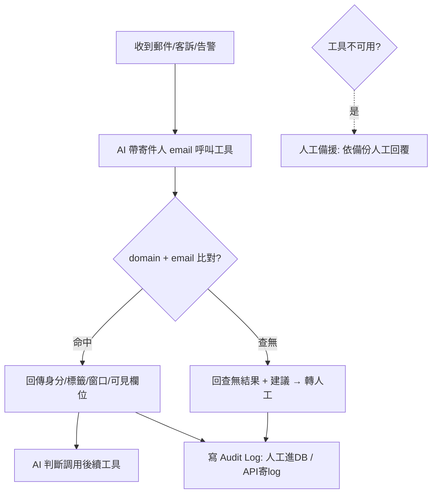

# 客戶資訊工具 Spec（Kyson · W3 定稿）

> 來源：綜整 A／B／C 三組衝突裁決 + 個人訪談紀錄 + [kyson_w3-需求清單.md](kyson_w3-需求清單.md)。
> 內容標準依 [m5-sdd.md](../01_自學模組/m5-sdd.md)（結構化 / 無歧義 / 可驗證），格式依 [spec-template.md](../03_範本/spec-template.md)。
> 規模基準：客戶約 **300 筆**、觸發式低併發（壓測估 1000 同時仍可撐）。

---

## 目的

讓 AI Agent 在收到郵件／客訴／告警時，能在 **1 分鐘內**解析出「這是誰的客戶、可查哪些資料、聯絡窗口是誰」，作為調用其他工具（3DS 交易分析等）的**前置識別層**——其他工具不知道客戶是誰就沒有意義。

---

## Stakeholder

| 角色 | 主要關心 | 不主動講但會在意 |
|---|---|---|
| 客服 / 雲服務同仁（使用者） | 查得快、查得準，太慢不如自己查 | 查無資料時要有明確下一步，而非空白 |
| AI Agent（呼叫方） | 拿到**結構化**身分資料才能判斷後續調用哪些工具 | 欄位語意要一致、不可有歧義 |
| Product Owner | 第一線體驗、成本控制 | 防詐騙（仿冒者觸發 AI 變更權限） |
| 主管 / 拍板者（批准） | 成本 vs SLA 平衡、資料新鮮度 | 資安取捨要由能拍板的人決定，不被組內喬掉 |
| SRE（Kyson，維運） | 服務穩定、監控、部署成本 | API 限流／成功率／token 用量、冷啟動可行性 |
| 資安 / 稽核（有 stake，不上場） | 個資加密、稽核留痕、PCI 可追責 | ISO-27001 導入後的資料異動 approve 流程 |
| 客戶（被影響） | 個資被正確保護、不被仿冒 | 誤把已解約客戶當有效客戶 |
| 未來接手者 / 新同事 / AI（有 stake） | 這份 spec 夠不夠照著做 | 隱性 baseline 有沒有被寫出來 |

---

## 用例 / 使用情境

1. **Happy path**：收到客訴郵件 → AI 帶寄件人 email 呼叫工具 → 工具比對 domain + email → 回傳客戶身分、系統性標籤、聯絡窗口、該角色可見欄位 → AI 據此判斷後續調用哪些工具 → 全程寫 audit log。
2. **例外 1（查無 / 清單外來信）**：寄件人不在客戶清單 → 回傳「查無結果」+ 建議（手動輸入 / 擴展搜尋條件）→ 轉**人工處理**（客戶資訊工具本就由人維護）。
3. **例外 2（工具不可用）**：工具掛掉 → 走人工備援流程，依平常備份資料人工回覆。
4. **例外 3（邊界：domain 對但 CC 含未知人）**：僅以**寄件人** domain 判定身分；CC 中的未知人標記為「待 escalate」，不自動授信（防詐騙）。

---

## 功能需求

> 編號、可獨立驗收、標 MoSCoW。涵蓋「沒人吵但必要的 baseline」+「W2 衝突裁決」。

| ID | 描述 | MoSCoW | 主要 Stakeholder |
|---|---|---|---|
| R1 | 依 email 查單筆客戶基本資料（最高頻 baseline） | M | 客服 / AI |
| R2 | 依**寄件人** domain 檢查客戶身分 | M | Owner / 資安 |
| R3 | 查無資料 / 清單外來信 → 回「查無結果」+ 建議 + 轉人工 | M | 客服 |
| R4 | 客戶聯絡窗口 / 聯絡人管理（現行無上限） | M | 客服 |
| R5 | 客戶服務項目管理（ACS、3DSS 等） | M | Owner |
| R6 | 系統性客戶標籤分類（排除人為彈性，影響 AI 回覆策略 / 優先序） | M | AI / Kyson |
| R7 | CLI 權限分層：**欄位級**唯讀控制（誰能看哪些欄位） | M | 資安 / SRE |
| R8 | 提供 CLI / API 供 AI Agent 呼叫 | M | AI |
| R9 | 操作留痕 Audit Log：人工查詢進 DB／API 呼叫寄 log | M | 資安 / 稽核 |
| R10 | 客戶查詢紀錄完整保存（歷史知識庫基礎） | M | 主管 |
| R11 | 工具不可用時的人工備援流程 | M | 客服 / SRE |
| R12 | SLA 管理 | M | 主管 / SRE |
| R13 | 批次查詢（公司全員 / 有效合約清單 / 單一聯絡人） | S | Owner |
| R14 | CLI 固定輸出格式，AI 再轉 md / csv | S | AI |
| R15 | 客戶資料維護排程（預設半年、可調） | S | Owner / 主管 |
| R16 | 合約狀態標記，防誤寄已解約客戶 | S | Owner |
| R17 | AI 協助產生客戶回覆內容 | S | 客服 |
| R18 | 監控告警（API 限流 / 成功率 / AI token 用量） | S | SRE |
| R19 | 寄件人外再加「CC 人」身分檢查 | C | 資安（未來再加） |
| R20 | 後台管理介面（UI） | C | 主管（初期 CLI 即可） |

---

## 非功能需求

- **效能**：單筆查詢 **P95 ≤ 1s**；端到端回應 ≤ 1 分鐘。
  - 規模假設：客戶約 **300 筆**、**觸發式低併發**（壓測估 1000 同時仍可撐）。
  - ⛔ **Queue / 排隊不做**——量化規模後屬假議題（A 組衝突 1 裁決 WON'T）。
- **安全**：個資（email / 手機 / 姓名）依個資法 **AES 加密、不明碼**；查詢全程寫 audit log；Tool ↔ AI 同 domain 通訊**不需額外加密**；API 須限流、成功率與 token 用量監控告警。
- **可用性**：工具掛掉須能以人工備份立即查；為平衡成本，**可接受冷啟動 / 排程喚醒 / 彈性擴展**達成 SLA（非核心交易系統，Owner 與主管均同意）。
- **合規**：依個資法（AES）；ISO-27001 **公司目前尚未導入**，若導入則資料流程異動須留紀錄、必要時 approve；PCI 涉資安操作須可追責（執行者 / approve / 主管）。

---

## 設計

> 重用個人訪談紀錄中的架構（資料視角 + 流程視角）。

### 資料

### 流程

---

## 驗收條件

> 對每條 Must（及關鍵 Should）給可執行的 Given / When / Then。

| ID | 對應需求 | 驗收條件（Given / When / Then） | 邊界情境 |
|---|---|---|---|
| T1.1 | R1 | Given 客戶 A 已存在 / When AI 帶 A 的 email 查詢 / Then 回傳 A 基本資料且寫 audit log | 查不到 → 見 T3.1 |
| T2.1 | R2 | Given 寄件人 domain 屬已知客戶 / When 查詢 / Then 判定為該客戶；CC 含未知人不影響判定 | domain 不符 → 拒絕授信 |
| T3.1 | R3 | Given email 不在清單 / When 查詢 / Then 回「查無結果」+ 至少 1 條建議 + 標記轉人工 | 空字串 / 格式錯誤 |
| T4.1 | R4 | Given 客戶 A 有 3 位聯絡人 / When 查 A 的聯絡窗口 / Then 回傳全部 3 位及其角色，不設數量上限 | 0 聯絡人 → 回空清單 |
| T5.1 | R5 | Given 客戶 A 訂閱 ACS 與 3DSS / When 查 A 的服務項目 / Then 回傳兩項及各自 SLA | 無服務項目 → 標 N/A |
| T6.1 | R6 | Given 客戶帶標籤「高風險」/ When AI 取得回傳 / Then 標籤為系統性固定值，無人為自由文字 | 無標籤 → 回預設分類 |
| T7.1 | R7 | Given 角色僅可見非敏感欄位 / When 該角色查含手機的客戶 / Then 手機欄位不回傳（或遮蔽） | 高權限角色可見 |
| T8.1 | R8 | Given AI Agent 經 API 呼叫 / When 帶合法參數查詢 / Then 回固定格式結構化結果並寫 log；參數非法回明確錯誤碼 | 逾時 / 觸發限流 |
| T9.1 | R9 | Given 任一查詢 / When 人工查詢完成 / Then DB 新增一筆 audit（誰、何時、查誰）；API 呼叫則寄 log | 查詢失敗也須留痕 |
| T10.1 | R10 | Given 任一查詢完成 / When 查詢結束 / Then 紀錄完整寫入 DB 可日後檢索；需發信案件額外標記 | 寫入失敗 → 觸發告警 |
| T11.1 | R11 | Given 工具不可用 / When 客服需查詢 / Then 可依備份資料人工回覆，流程有明確指引 | 備份過期 → 標註時間 |
| T12.1 | R12 | Given 服務處於冷啟動 / When 收到查詢 / Then 於約定 SLA 時間內回應，未達標觸發告警 | SLA 秒數待定（見開放問題） |
| T13.1 | R13 | Given 有效合約清單需求 / When 批次查詢 / Then 回固定格式清單，AI 可轉 md/csv | 0 筆 / 大量筆數 |
| T16.1 | R16 | Given 客戶 A 已解約 / When 查詢 A / Then 回傳結果標記「已解約」，避免誤寄 | 解約當日邊界 |

---

## 限制條件

- **技術**：Tool ↔ AI 同 domain 內通訊；CLI 優先（UI 後評估）；個資須 AES 加密；部署平台 **AWS vs GCP 未定**。
- **合規**：依個資法 AES；PCI 要求可追責——**無人可追責的自動化功能不做**（如 AI 自動改防火牆白名單，已裁 WON'T）；ISO-27001 尚未導入。
- **時程**：W3（2026/6/18）課堂定稿。
- **資源**：SRE 團隊維運；規模 300 客戶、非核心交易系統。

---

## 開放問題 / TBD

- [ ] **domain 自動歸戶 vs CC 人工防詐騙**：已先做寄件人 domain；CC 人檢查（R19）是否做、做到何種程度 — 需先向主管講資安風險再決定。**（待 escalate）**
- [ ] **AI ↔ Tool 對接流程**：方案 A（訊息→AI→工具→AI→其他工具）vs 方案 B（訊息→客戶分層→工具→AI→其他工具）— 待 AI Agent 整體流程定案。
- [ ] **部署平台 AWS vs GCP**：SRE 偏 AWS，主管要求便宜優先 — SRE 列價格交主管審核。**（待 escalate）**
- [ ] **ISO-27001 導入時程與 approve 範圍**：導入後資料異動留痕 / approve 門檻 — 待主管 / 資安拍板。**（待 escalate）**
- [ ] **歷史紀錄存放位置**：Developer Site vs 與工具放一起（利於 AI 追蹤客戶轉交脈絡）— 待 AI 流程定案。
- [ ] **服務常駐 vs 冷啟動的最終 SLA 秒數** — 待壓測結果與主管確認。

---

## Traceability

| 需求 ID | 規格段落 | 驗收 ID |
|---|---|---|
| R1 | §功能需求 R1 + §設計-流程 | T1.1 |
| R2 | §功能需求 R2 + §用例-例外3 | T2.1 |
| R3 | §功能需求 R3 + §用例-例外1 | T3.1 |
| R4 | §功能需求 R4 + §設計-資料 | T4.1 |
| R5 | §功能需求 R5 + §設計-資料 | T5.1 |
| R6 | §功能需求 R6 + §設計-資料 | T6.1 |
| R7 | §功能需求 R7 + §非功能-安全 | T7.1 |
| R8 | §功能需求 R8 + §設計-流程 | T8.1 |
| R9 | §功能需求 R9 + §非功能-安全 + §設計-流程 | T9.1 |
| R10 | §功能需求 R10 + §設計-資料 | T10.1 |
| R11 | §功能需求 R11 + §用例-例外2 | T11.1 |
| R12 | §功能需求 R12 + §非功能-可用性 | T12.1 |
| R13 | §功能需求 R13 | T13.1 |
| R16 | §功能需求 R16 | T16.1 |
| R14, R15, R17, R18 | §功能需求（Should） | 待補（次優先） |
| R19, R20 | §開放問題 / §功能需求（Could） | N/A 本階段 |

> 全部 12 條 Must 皆已對應驗收條件。R14/R15/R17/R18（Should）驗收待補；R19/R20（Could）本階段不訂驗收。
> ⚠️ T12.1 的 SLA 秒數仍依賴開放問題「服務常駐 vs 冷啟動 SLA」拍板後才能填具體數字。
